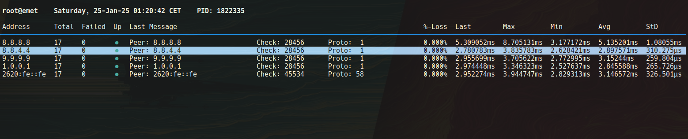

# mping

Simple tool I was mostly missing in specific situation when pinging multiple hosts would have been neat.

# Usage

```
$ > mping -h
Usage of mping:
  -a value
    	Whitespace separated list of hosts to ping
  -addresses value
    	Whitespace separated list of hosts to ping
  -help
    	Show help message and exit
  -v	Show version number and exit
  -version
    	Show version number and exit
```

Starting and then presing `?` will yield some more specific information.

# Installation

Perhaps this should be enough:

```
go install github.com/nevious/mping@latest
```

## Go Versions

* go version go1.21.13 linux/amd64
* go version go1.23.2 linux/amd64

# Run

Run with `sudo` as most users will not have permission to use ICMP sockets.

```
sudo mping -a 8.8.8.8,8.8.4.4,9.9.9.9,1.0.0.1,2620:fe::fe
```


